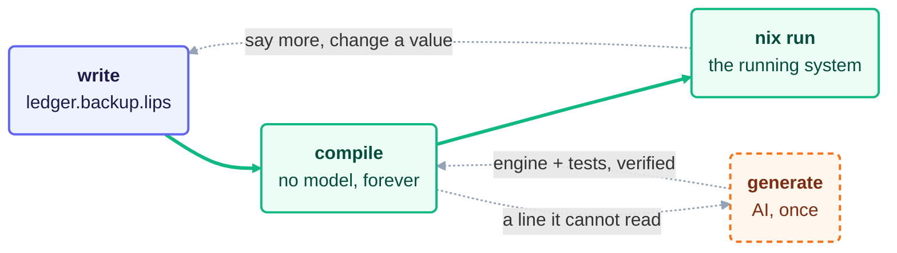

  

# lips

lips turns plain sentences into the configuration and code a system runs: a
NixOS machine, a home-manager home, a Kubernetes cluster, a Terraform cloud.
A model reads your wording once and writes a small compiler for it. Every build
after that runs this compiler offline, yields the same bytes every time, and
calls no model.

## Three Lines In, a Module Out

This file, `ledger.backup.lips`, is a complete lips program:

    back up /var/lib/ledger to /backup/ledger daily.
    keep 14 daily snapshots.
    credentials come from /etc/ledger-backup.env.

Before this file compiles, its language must exist. One model call
(`lips generate ledger.backup.lips`) *mints* the language `backup` from it:
the model writes a grammar and a set of rules, and lips verifies them. The
repo ships the result in `examples/backup/`. A grammar pattern reads a line
and names the facts in it:

    back up <source> to <dest> <schedule>
      => fact backup.source "<source>" ; fact backup.dest "<dest>" ; fact backup.schedule "<schedule>"

A rule maps one fact onto an option the target system already defines:

    match fact backup.dest => services.restic.backups.<self>.repository "<value>"

Three patterns and five rules make up the whole language. (The lines above are
simplified: each real line also carries an id, a provenance stamp and Nix
quoting.) From now on, `lips compile ledger.backup.lips` runs with no model.
It first shows how it read each line. A line *crystallizes* when it matches a
pattern (`p1` to `p3`) and yields named facts:

    ledger.backup.lips: 3 of 3 lines crystallize.
      line 1  ok        p1  backup.source, backup.dest, backup.schedule
      line 2  ok        p2  backup.retention
      line 3  ok        p3  backup.credentials

lips calls each fact read from a program a *decision*. Then compile writes a
NixOS module. Each option carries a comment naming the decision it came from
(`d1.2` is the second fact of line 1) and the rule that placed it (`r2`):

    # <-d3 via r5
    services.restic.backups.ledger.environmentFile = "/etc/ledger-backup.env";
    # <-d1.1 via r1
    services.restic.backups.ledger.paths = [ "/var/lib/ledger" ];
    # <-d2 via r4
    services.restic.backups.ledger.pruneOpts = [ "--keep-daily 14" ];
    # <-d1.2 via r2
    services.restic.backups.ledger.repository = "/backup/ledger";
    # <-d1.3 via r3
    services.restic.backups.ledger.timerConfig.OnCalendar = "daily";

Change `14` to `30` and compile again: the module follows, and no model runs.
Add a sentence the language has never seen, and compile stops instead of
guessing:

      line 4  no match  "email me when a backup fails."
    ledger.backup.lips has lines its language cannot read yet.
    → grow the language: lips generate ledger.backup.lips

That is the whole experience. The rest of this page explains how it works and
why it is built this way.

## Why Review a Language

Machines now write code faster than people can check it. Sonar's [2026 State of
Code Developer
Survey](https://www.sonarsource.com/state-of-code-developer-survey-report.pdf)
polled 1,149 professional developers in October 2025: they report 42 percent of
their code as AI-generated or assisted, 96 percent do not fully trust that such
code is functionally correct, and only 48 percent always check it before they
commit.

lips answers by moving review from programs to languages. The model writes a
compiler once, and that compiler writes every program's output from then on.
You review the language once: its grammar, its rules, its tests and a
plain-language `README.md` describing it. After that, a new program in the
language needs no review of mechanism. You read its own few lines of meaning,
and `compile` shows you how the machine read them. Review work grows with the
number of languages you keep, while the number of programs can grow freely.
Minting a language a second time is the one event that reopens review, and
the committed tests gate it.

## How It Works

Three words carry the design:

- A **program** is your `.lips` file. You write it, and it is the only artifact
  lips cannot regenerate.
- An **engine** is the compiler for one language: a grammar that reads the
  sentences, rules that map them onto a target, and tests that pin the result.
  An engine is plain data. A model writes it (mints it), lips runs it.
- A **world** is what the output targets: `nixos`, `home-manager`, `kubenix`,
  `terranix`, or a world file of your own. `lips world` lists them.

Work then moves in three steps, and only the middle one touches a model.

**1. Write.** State what you want in plain lines, in any human language
(`examples/hello.lips` is German). A file named `<instance>.<language>.lips`
names both: `ledger.backup.lips` is the instance `ledger` in the language
`backup`. A sibling `photos.backup.lips` reuses the same engine with no new AI
call and no new mechanism to review, and the two instances compose in one
configuration without collision. `backup.lips` alone is shorthand for a
language with a single instance.

**2. Generate, once.** `lips generate ledger.backup.lips` mints the engine:
the grammar, the rules, the tests and a `README.md` for the language. Pass
several programs and it generalizes one grammar across all of them. lips writes
nothing unless the new engine reads every program and its tests hold, so a bad
mint costs you nothing. Every option a rule names is checked against the
target world's pinned option schema, so a rule naming an option that does not
exist there is refused before anything is written.

To steer *how* the engine gets built, put a plain-text `<language>.direction`
file beside your programs ("prefer restic over rsync", "no docker"). It guides
`generate` only and stays advisory. Anything that must hold belongs in the
program.

**3. Compile, forever.** `lips compile ledger.backup.lips` writes a directory
holding `default.nix` (the module to import and deploy) and a `flake.nix` that
makes the directory runnable. Running is not a lips command: `compile` prints
the stock `nix` commands for what it just built, and you pick one. A NixOS
module offers a throwaway QEMU boot, a build without booting, and a dev shell
with exactly the tools your program adds. A kubenix module renders YAML for
`kubectl`; a terranix module renders `config.tf.json` for `tofu plan`. Nothing
applies anything to your host. `lips check <program>` re-verifies the committed
tests, in CI or before a merge.

## Configuration and Behaviour

An engine produces two kinds of output.

**Configuration** maps a sentence onto options that already exist. nixpkgs
defines what `services.restic.backups.<name>.paths` means; the engine only
names it, and the schema check at generate time proves the name is real. The
tests in `.expect` pin which option each decision lands in.

**Behaviour** covers what no option can express: a program that filters,
computes or decides. Here the engine emits *clauses*, small pure functions in a
safe subset of Scheme, each traced back to the program line it came from.
Guile, a Scheme implementation, runs them. A program can also state a *claim*, an example of what it must do,
and `compile` runs every claim against the clauses and fails if one does not
hold. `examples/logscan.lips` is a complete command-line tool:

    filter JSON lines read from standard input.
    keep a line only when every field named on the command line equals the value given with it.
    print each kept line unchanged.
    install the tool as the command logscan.
    given the lines {"a":"1"} and {"a":"2"} with a=1, print only {"a":"1"}.

Its last line is the claim. `compile` writes the tool into the output
directory as its *site*: `nix run <dir>#site` runs it, and
`nix build <dir>#site-claims` re-runs the claims.

lips never accepts source code written by the model. Logic arrives as clauses
that lips checks line by line. Anything built arrives as an existing nixpkgs
package or builder, named by reference. A mint that tries to ship its own
source file is refused, with the remedies named.

## Languages Compose

A program can use the clauses another language exports. One sentence links
them:

    the players come from the player language.

`lips exports player` lists what the `player` language offers. The `libero/`
folder carries the largest example: a football manager whose rules are plain
lines. Its `season` language calls `match`, which calls `player`, so one season
table rests on three languages, each reviewed on its own.

Composition stops at behaviour for now. One program cannot yet name another
program's configuration option or built package; `TODO.md` tracks it.

## Why You Can Trust It

Each of these properties is something you can check yourself.

- **Determinism.** `compile` and `check` never call a model, so the same
  program yields the same bytes on any machine. That gives you something to
  diff, bisect and audit, which a model producing fresh output on every run
  never does.
- **Deduce or fail.** An unreadable line is an error that names its remedy.
  lips never guesses, and invents nothing your program does not state.
- **Gated change.** A re-minted engine is accepted only if the committed tests
  in `.expect` still hold. To change behaviour on purpose, you say how far
  those tests may move: `--compat backwards` lets new assertions join,
  `forwards` lets assertions the engine no longer fills leave, `none` rewrites
  them. The resulting diff of `.expect` is your semantic changelog.
- **A full audit trail.** Every line a model wrote ends in `@gen:<id>`, the
  hash of the one AI call that produced it. The language's `.generation` file
  records that call: the model, the pinned nixpkgs, and the full prompt. The
  prompt itself is reviewable in two halves: the world-neutral half lives in
  `assets/mint/` in this repo, the world's half in its world file. Every
  compiled option and clause points back to the program line behind it.

## Limits

lips renders desired state and stops. Applying it stays an explicit human act,
so live cloud APIs that must be polled and reconciled are out of scope. GitOps
fits that other half naturally: `compile` writes a deterministic, committable
directory, which is exactly what a reconciler wants. Use Flux or Argo CD for
kubenix output, `nixos-rebuild` or deploy-rs for a NixOS module, `tofu apply`
in CI for terranix. Because the same program yields the same bytes, a commit is
a real diff of intent and a revert is a real rollback. None of this is a lips
feature; it follows from the shape of the output.

A rule can only name vocabulary that already exists. lips is strongest at
assembling a system out of named parts and at small pure logic; it does not
invent new mechanism.

`generate` needs the [`pi`](https://github.com/earendil-works/pi) binary on your
PATH, authenticated against a model provider. Mint quality varies by model, and
lips records which model wrote what. Budget a strong model for any program that
builds something.

`DESIGN.md` §13 keeps the ledger of what is done, partial and missing.

## Try It

The examples live in this repo:

    git clone https://github.com/cornerman/lips && cd lips

    lips compile examples/ledger.backup.lips   # three lines -> module dir + flake
    lips check examples/ledger.backup.lips     # the committed contract still holds

Without installing anything:

    nix run github:cornerman/lips -- compile examples/ledger.backup.lips

Then pick an example by what you want to see:

| Example | Shows |
|---|---|
| `examples/photos.backup.lips` | a second instance of the `backup` language, no new mint |
| `examples/greet.lips` | home-manager: two commands on your PATH, one run daily |
| `examples/logscan.lips` | behaviour as clauses, checked by a claim |
| `examples/board.lips` | a terminal kanban board, home-manager |
| `examples/report.cron.lips` | one program compiled to NixOS and kubenix |
| `examples/assets.bucket.lips` | terranix |
| `examples/dev.policy.lips` | seven sentences become a [nono](https://nono.sh) agent-sandbox profile through `examples/nono.world`, a world lips does not ship |
| `libero/` | several languages composed into a football manager |

## Commands

Three commands do the work, and only `generate` calls a model:

| Command | What it does |
|---|---|
| `lips generate <program>...` | Mint the language, or grow it to read new lines. Patches the committed engine; `--fresh` rewrites it. |
| `lips compile <program>` | Write the output directory and print the `nix` commands that run it. `--watch` recompiles on every save. |
| `lips check <program>` | Re-verify the committed tests, offline. |

`generate -t <world>` picks the target world. A new language defaults to
`nixos`, and a re-mint keeps the worlds the language already has. Repeat `-t`
to target several worlds in one call. `-m <model>` picks the model,
`--compat` is explained under "Gated change" above, and `--help` lists the
rest.

Four more commands support editing and inspection, and none of them changes
anything:

| Command | What it does |
|---|---|
| `lips options <query>` | Search a world's pinned option schema. |
| `lips exports <language>` | List the clauses a language offers to other programs. |
| `lips world` | List the available worlds, or print one. |
| `lips lsp` | Serve completion and live diagnostics to any editor, for every lips language. Glue for Neovim, Vim, VS Code and Helix lives in `editors/`. |

## Install

Add the flake as an input and put the package in `environment.systemPackages`
or `home.packages`:

    inputs.lips.url = "github:cornerman/lips";                          # flake input
    inputs.lips.packages.${pkgs.stdenv.hostPlatform.system}.default     # the package

That package is all `compile`, `check` and `lsp` need; they use only `nix`
itself. `generate` also needs `pi`, which lips keeps out of its own closure on
purpose: `pi` is your harness and carries your credentials. lips calls it
hermetically, without your session, tools or extensions, and hashes everything
the model saw into `.generation`.

## Deploy

Point `lib.modulesFromDir` at the directory holding your `.lips` files. It
compiles each program inside a derivation, offline, and files the module under
its world:

    { inputs, pkgs, ... }:
    let lips = inputs.lips.lib.modulesFromDir { inherit pkgs; dir = ./lips; };
    in { imports = [ lips.nixosModules.ledger ]; }

A home-manager program appears under `homeManagerModules.<instance>`, kubenix
under `kubenixModules.<instance>`, terranix under `terranixModules.<instance>`.
Three details matter:

1. Nix flakes see only git-tracked files, so `git add` your program and its
   language folder before rebuilding.
2. The compile inside the derivation cannot run `nix`, so it skips the
   behavioural tests. Run `lips check <program>` in your repo instead.
3. An imported module evaluates under *your* nixpkgs, like any module. The
   nixpkgs its rules were checked against is the `schema:` line in the
   language's `.generation`. For a world built on nixpkgs (`nixos`, `nono`),
   the directory `lips compile` writes uses exactly that pinned nixpkgs, so
   `nix build` there shows the program as it was checked.

## The Files

Your programs sit at the top level. Everything the machine writes for a
language goes into one folder named after it, so a directory listing shows
what you own and nothing else:

    ledger.backup.lips          <- yours
    photos.backup.lips          <- yours
    backup.direction            <- yours (optional advice for the mint)
    backup/                     <- the machine's, all of it
      backup.grammar            <- how every program is read, shared by all worlds
      nixos/                    <- one folder per world the language targets
        backup.rules            <- where each decision lands in this world
        backup.expect           <- the tests for this world
        backup.generation       <- receipt of the exact AI call, and what it pinned
        backup.timing           <- what the mint cost: model, seconds, turns
        nixos.world             <- the world file, copied verbatim
        README.md               <- the language in plain words, for your review
      out/                      <- derived, safe to delete, git-ignored by lips

The grammar decides how a program is *read*; a world folder decides where it
*lands*. `out/` holds one compiled directory per instance and world, plus the
`<instance>.decisions` file `generate` writes: the reading of your program as a
list of decisions. Everything outside `out/` belongs in git.

## Where This Sits

lips is model-driven development at the scale where field studies found it
works. Whittle, Hutchinson and Rouncefield observed that practitioners "rarely
use it to generate whole systems; rather, they apply it to develop key parts of
a system often using domain-specific modeling languages developed specifically
for the purpose" (["The State of Practice in Model-Driven
Engineering"](https://staffwww.dcs.shef.ac.uk/people/A.Simons/remodel/papers/WhittleMDE_Draft.pdf),
IEEE Software 31(3), 2014). What kept that practice rare was the cost of
building each such language and its generator. lips mints both in one model
call and treats them as disposable. `DESIGN.md` §"Position in the Field"
carries the full argument and its evidence.

## Built With AI

AI agents wrote nearly all of lips under my direction. I set the design, the
invariants and the gates, and reviewed those rather than every line. So judge
it by what you can run (`just test`, `just ci`, `just check-expect`) and by
where the risk sits.

The kernel is about 9,000 lines of Haskell, covered by some 1,200 test cases.
Its center, merging decisions, is pinned by properties checked over randomly
generated inputs: the specification in `DESIGN.md` §2, made executable. Reading
and compiling are pinned by chosen examples instead, so bugs can hide where the
suite does not reach. `DESIGN.md` §13 names the places I know of.

## Repository Layout

- `kernel/` is the deliverable: the domain-blind compiler and its test suite.
  Module map in `kernel/README.md`.
- `examples/` holds demonstration programs with their minted engines.
- `libero/` is a larger project built from composed languages.
- `assets/` holds the mint prompt, the built-in worlds and the clause runtime.
- `editors/` holds the editor glue for `lips lsp`.
- `DESIGN.md` is the living design document; §13 tracks milestones.
- `TODO.md` tracks what is still open.
- `justfile` is the command index for developing lips. Run `just` to list it.
