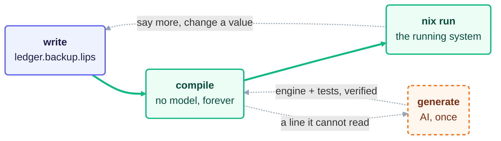

  

# lips

lips turns plain sentences into the configuration and code a system runs: a
NixOS machine, a home-manager home, a Kubernetes cluster, a Terraform cloud.
You write what a system should do. A model reads your wording once and mints a
small compiler for it. From then on, every build is offline, deterministic, and
runs no model.

The point is to keep what a human owns small enough to read. Machines now write
code faster than anyone can review it, so lips moves review from programs to
languages. You review a language once: its grammar, its rules and its tests.
After that, each program in it compiles through the same engine with no model,
so a new program asks for no review of mechanism, only a reading of its own few
lines of meaning. Review work grows with the number of languages, not the number
of programs. A re-mint is the one event that asks for review again, and the
committed tests gate it.

## The Idea

Writing your intent and building a language for it are the same act.

Start by writing what you want:

    back up /var/lib/ledger to /backup/ledger daily.
    keep 14 daily snapshots.
    credentials come from /etc/ledger-backup.env.

That file is already a valid program. `lips generate` mints an **engine** from
it: a grammar that reads sentences like yours, rules that map them to real
options of the system being configured, and tests that pin your values. The
wording you chose defines a small language for your problem, and lips hands you
its compiler.

From then on no model runs. `lips compile` writes a Nix module offline and
bit-identical, every time. Edit a path or a number and compile again; the change
flows straight through. A line the engine cannot read fails loudly and sends you
back to `generate`. lips never guesses.

## Why You Can Trust It

Four properties, each one you can check yourself:

- **Determinism.** `compile` and `check` never call a model, so the same program
  yields the same bytes on any machine. A model that writes valid but different
  output each run leaves you nothing to diff, bisect, or audit.
- **Deduce or fail.** An unreadable line is an error naming its remedy, never a
  guess. What your program does not state stays uninvented.
- **Gated change.** A fresh engine is accepted only if the committed tests still
  hold. To move behavior on purpose you say how far the contract may travel
  (`generate --compat backwards|forwards|none`), and that diff is your semantic
  changelog.
- **A full audit trail.** Every minted line ends in `@gen:<id>`, the hash of the
  one AI call recorded in `<language>.generation`. The prompt lips sends is a
  reviewable file, not a secret: its world-neutral half sits under `assets/mint/`
  in this repo, the world's own half in the world file. And
  `out/<instance>.decisions` shows how the machine read you, one statement per
  line, so you can ask "did it understand me?" before trusting anything.

## What It Does Not Do

lips renders desired state and stops. Applying it stays an explicit human act,
so live cloud APIs that must be polled and reconciled are out of scope.

GitOps is the natural vehicle for that other half. What `compile` writes is a
deterministic, committable directory, which is exactly the input a reconciler
wants: Flux or Argo CD for kubenix output, `nixos-rebuild` or deploy-rs for a
NixOS module, `tofu apply` in CI for terranix. Since the same program yields the
same bytes, a commit is a real diff of intent and a revert is a real rollback.
None of this is a lips feature; it follows from the shape of the output.

A rule can only name a vocabulary that already exists: nixpkgs defines what
`services.restic.backups.<name>.paths` means, and lips looks the name up rather
than inventing it. Configuring a system out of named parts is where lips is
strongest; inventing mechanism is not what it does.

`generate` needs the `pi` binary on your PATH, authenticated against a provider.
Mint quality varies by model, and lips records which model wrote what. Budget a
strong model for any artifact-bearing program.

Composing two lips languages (one program using another's exports) is designed
but not yet wired through the mint. `TODO.md` tracks it, and `DESIGN.md` §13
carries the honest ledger of what is done, partial, and missing.

## Built With AI

Nearly all of lips was written by AI agents under my direction: I set the
design, the invariants and the gates, and reviewed those rather than every line.
So judge it by what you can run (`just test`, `just ci`, `just check-expect`)
and by where the risk sits. The kernel is about 3,700 lines, and its center,
merging decisions, is pinned by algebra over randomly generated bases, which is
the specification in `DESIGN.md` §2 made executable. Reading and realizing are
pinned by chosen examples instead, so bugs can hide where the suite does not
reach; `DESIGN.md` §13 names where I know that happens.

## Where This Sits

Everyone is answering the same problem: machines write code faster than people
can check it. Sonar's [2026 State of Code Developer
Survey](https://www.sonarsource.com/state-of-code-developer-survey-report.pdf)
(1,149 professional developers polled in October 2025) finds 42 percent of their
code AI-generated or assisted, 96 percent not fully trusting that AI-generated
code is functionally correct, and only 48 percent always checking it before they
commit. lips differs from the other answers in one move: the model writes a
**compiler**, not code, and it runs once. That is model-driven development at
the scale field studies found it actually works, applied to "key parts of a
system often using domain-specific modeling languages developed specifically for
the purpose" (Whittle, Hutchinson and Rouncefield, ["The State of Practice in
Model-Driven
Engineering"](https://staffwww.dcs.shef.ac.uk/people/A.Simons/remodel/papers/WhittleMDE_Draft.pdf),
IEEE Software 31(3), 2014), with the cost that kept it rare removed: the
generator is minted in one call and disposable. `DESIGN.md` §"Position in the
Field" carries the long argument and its evidence.

## The Loop

Three moves: write, generate, compile. Only the middle one touches a model.

**Write.** State intent in plain lines. This is the only artifact you own and
the only one you cannot regenerate.

A program is named `<instance>.<language>.lips`, so `ledger.backup.lips` is the
instance `ledger` written in the language `backup`. A sibling
`photos.backup.lips` reuses the same grammar with no new AI and no new engine
to review, and the two compose in one configuration without collision. `backup.lips` alone is the
singleton shorthand; add named instances later, no re-mint. Editors key on the
constant `.lips` extension, and `lips lsp` serves completion and live
diagnostics for any language, with no per-language setup (glue for neovim, vim,
VS Code and Helix in `editors/`).

**Generate, once.** `lips generate ledger.backup.lips` mints the grammar, the
rules, the tests and a plain-language `README.md` for the language. Pass several
programs and it generalizes one grammar across them. Nothing is written unless
the engine compiles every program and the tests hold, so a bad mint costs you
nothing.

`-t <world>` picks the world the engine is born into: `nixos` (default),
`home-manager`, `kubenix`, `terranix`, or any `<name>.world` file beside your
program. A world is data, not a lips feature, so a world lips never heard of
works without changing lips (`lips world` lists them). Repeat the flag to mint
several worlds in one call. Every minted option path is grounded against that
world's own pinned schema, the same one `lips options <query>` searches, so a
path that does not exist there is refused before anything is written.

To express taste about *how* the engine gets built, put a plain-text
`<language>.direction` file beside your programs ("prefer restic over rsync",
"no docker"). It steers `generate` only and stays advisory; anything that must
hold belongs in the program.

**Compile, forever.** `lips compile ledger.backup.lips` writes a directory
holding `default.nix` (the module, for import and deploy), any staged
`artifacts/`, and a `flake.nix` that makes the directory runnable. Running is
not a lips verb: `compile` prints the stock `nix` commands for what it just
built, and you pick one. A NixOS module offers a throwaway QEMU boot, a build
without booting, and a dev shell holding exactly the tools your program adds. A
kubenix module renders multi-document YAML for `kubectl`, a terranix module a
`config.tf.json` for `tofu plan`. No command applies anything; the host is never
touched.

`lips check <program>` re-verifies the committed tests offline, in CI or before a
merge.

## The Files

Your programs sit at the top level; everything the machine writes for a language
goes in one folder named after it. A directory listing shows what you own and
nothing else:

    ledger.backup.lips          <- yours
    photos.backup.lips          <- yours
    backup.direction            <- yours (optional taste for the mint)
    backup/                     <- the machine's, all of it
      backup.grammar            <- how every program is read, shared by all worlds
      nixos/                    <- one folder per world it was minted into
        backup.rules            <- this world's lowering
        backup.expect           <- this world's behavioral tests
        backup.generation       <- receipt of the exact AI call, and what it pins
        nixos.world             <- the world it was minted into, copied verbatim
        README.md               <- the language in plain words, your review artifact
      artifacts/                <- source the engine builds, when a program needs one
      out/                      <- derived, safe to delete, git-ignored by lips

The grammar says how a program is *read* and is shared by every world; a world
folder holds where a program *lands*. Everything under `out/` is per instance and
per world: `ledger.decisions` and the compiled module directory. Everything else
belongs in git.

## Install

Add the flake as an input and put the package in `environment.systemPackages` or
`home.packages`:

    inputs.lips.url = "github:cornerman/lips";                          # flake input
    inputs.lips.packages.${pkgs.stdenv.hostPlatform.system}.default     # the package

That one package is all `compile`, `check` and `lsp` need; they use only `nix`
itself. `generate` also wants `pi` on your PATH, which lips deliberately keeps
out of its own closure because it is your harness and carries your credentials.
lips calls it hermetically, stripping your ambient session, tools and
extensions, and hashes everything the model saw into `.generation`.

Prefer to install nothing yet:

    nix run github:cornerman/lips -- compile ledger.backup.lips

To deploy, point `lib.modulesFromDir` at the directory holding your `.lips`
files. It compiles each one in a derivation, offline, and labels it by its
world:

    { inputs, pkgs, ... }:
    let lips = inputs.lips.lib.modulesFromDir { inherit pkgs; dir = ./lips; };
    in { imports = [ lips.nixosModules.ledger ]; }

A home-manager engine appears under `homeManagerModules.<instance>`, kubenix
under `kubenixModules.<instance>`, terranix under `terranixModules.<instance>`.
Nix flakes see only git-tracked files, so `git add` your program and its
language folder before rebuilding. The compile inside that derivation cannot run
`nix`, so it skips the behavioral contract; check it where it lives, with
`lips check <program>` in your repo.

An imported module evaluates under YOUR nixpkgs, like any module you import.
The nixpkgs its rules were grounded against is the `schema:` line in the
language's `.generation`. For a world grounded on nixpkgs (nixos, nono), the
directory `lips compile` writes runs against exactly that one, so `nix build`
over it shows the program under the nixpkgs its rules were checked against.

## Try It

The examples live in the repo:

    git clone https://github.com/cornerman/lips && cd lips

    lips compile examples/ledger.backup.lips   # plain lines -> module dir + flake
    lips check examples/ledger.backup.lips     # the committed contract still holds

`compile` prints the nix commands that run the result. Open
`examples/ledger.backup.lips`, change `/backup/ledger` or `14`, and compile
again: the module updates without a model call. Then add a sentence the language
cannot read and watch it fail loud, pointing you back to `generate`.

For reuse, see `examples/photos.backup.lips`, a second instance of the same
language. For intent that needs something built rather than only configured, see
`examples/greet.lips`, whose engine builds the command it names and puts it on
your PATH. Other examples cover the other worlds: `examples/report.cron.lips`
compiles to NixOS and kubenix at once, `examples/assets.bucket.lips` to
terranix, `examples/board.lips` to home-manager. For a world lips does not
ship, see `examples/dev.policy.lips`: seven permission sentences compile to a
[nono](https://nono.sh) agent-sandbox profile through `examples/nono.world`, a
world file that lives beside the program rather than inside lips.

## Layout

- `kernel/` is the deliverable: the decision calculus and its conformance suite.
  Module map in `kernel/README.md`.
- `examples/` holds demonstration programs with their minted engines.
- `DESIGN.md` is the living design doc; §13 tracks milestones.
- `TODO.md` tracks what is still open.
- `justfile` is the command index for developing on lips itself. Run `just` to
  see every recipe.
