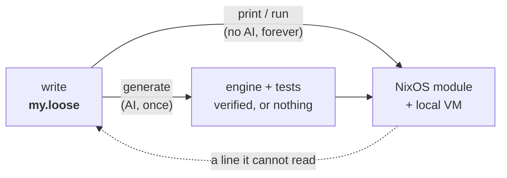

# lips

Describe what a system should do in plain lines. lips grows a small language
around exactly those words and gives you its compiler for free; from then on it
turns your intent into a running system deterministically, with no AI in the
loop.

The point is to keep what a human owns small enough to read. AI now writes code
faster than anyone can review it, so lips shrinks the reviewed artifact to a few
lines of meaning and makes everything the machine derives from them reproducible
and offline.

## The Idea

Writing your intent and building a language for it are the same act.

You start by writing plainly what you want:

    back up /var/lib/ledger to /backup/ledger daily.
    keep 14 daily snapshots.
    credentials come from /etc/ledger-backup.env.

That file is already a valid program. When you run `generate` once, a model
reads your lines and mints a small **engine**: the grammar that reads sentences
like yours, the rules that map them to real NixOS options, and tests that pin
your values. In other words, the wording you chose defines a little language
for your problem, and lips hands you the compiler for it.

From then on the AI is gone. `print` compiles your text to a NixOS module
offline and bit-identical, every time. Edit a path or a number and print again;
the change flows straight through. The language you grew stays yours to write
in, and the compiler keeps working without a model ever running again.

A line the engine cannot read fails loudly and sends you back to `generate`.
lips never guesses.

## How You Work With It

The loop has three moves. Only the first touches a model.

**Write.** State intent in plain lines. This is the only artifact you own and
the only one you cannot regenerate. Keep it short and truthful.

**Generate (once, AI).** `lips generate my.loose` mints the engine and the
tests for your program. lips refuses to write anything unless the engine
actually compiles your program and the tests hold, so a bad mint costs you
nothing.

**Print and run (forever, no AI).** `lips print my.loose` compiles your text to
a NixOS module. `lips run my.loose` goes further and boots that module in a
throwaway local VM, so you can watch it work without touching your host.

You then edit freely. Value and wording changes covered by your language run
straight through `print`. You return to `generate` only when you say something
genuinely new that the language cannot yet read, and even then regeneration is
gated: a fresh engine is accepted only if the committed tests still hold. To
change behavior on purpose you delete the `.expect` file and regenerate, and
that diff is your semantic changelog.

## Try It

With direnv, run `direnv allow` once. Otherwise prefix each command with
`nix develop -c`.

    just print examples/backup.loose   # loose text -> NixOS module (offline)
    just run   examples/backup.loose   # ... and boot it as a local VM (needs KVM)
    just generate path/to/my.loose     # mint a language for your own program (AI, needs pi)
    just test                          # conformance suite

Open `examples/backup.loose`, change `/backup/ledger` or `14`, and run
`just print` again. The module updates with no AI. Then add a sentence the
language does not know and watch it fail loud, pointing you back to `generate`.

Sometimes intent needs a program written, not just a package configured.
`examples/hello-server.loose` asks for a small HTTP server; its engine builds
that server from generated Go source (a Nix `buildGoModule` derivation) and
runs it as a service. The source is a committed, reviewable file beside the
program; the build and run stay deterministic and offline. The `artifact-vm`
flake check compiles it and boots the service in a VM.

## The Files

For a program `my.loose`, everything else sits beside it. You own the first
line; the machine writes the rest.

| File | Author | Role | In git |
|------|--------|------|--------|
| `my.loose` | you | the program, the only real source | yes |
| `my.loose.lang` | AI, once | the engine (grammar + rules + tests) | yes |
| `my.loose.expect` | AI, once | behavioral tests that gate regeneration | yes |
| `my.loose.generation` | machine | receipt of the exact AI call | yes |
| `my.loose.decisions` | machine | the machine's reading of your program | no (cache) |

Everything the machine writes is traceable. Each `.lang` line ends in
`@gen:<fingerprint>`, the hash of the AI call recorded in `.generation`. And
`.decisions` shows how the machine read you, one precise statement per line, so
you can check "did it understand me?" before trusting the output.

If everything burned down, the `.loose` file is the only thing you could not
recreate. That is the whole point.

## Layout

- `kernel/` is the deliverable: the decision calculus and its conformance
  suite. Module map in `kernel/README.md`.
- `examples/` holds demonstration programs with their minted engines.
- `docs/superpowers/specs/` holds the design doc,
  `2026-07-18-lipsidea-design.md`, whose section 13 tracks milestones.
- `justfile` lists every command. Run `just` to see them.
