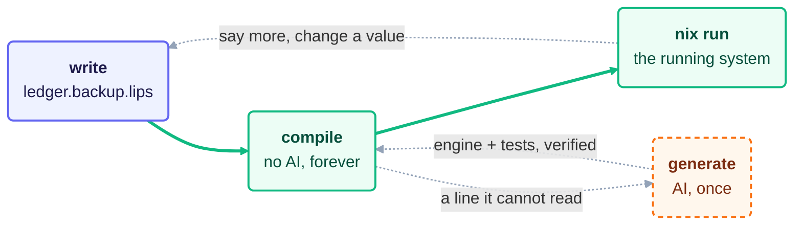

  

# lips

Describe what a system should do in plain lines. lips grows a small language
around exactly those words and gives you its compiler for free; from then on it
turns your intent into a running system deterministically, with no AI in the
loop.

What it compiles to is Nix: a module of `path = value` assignments that some
`evalModules` consumes. NixOS is one such world, home-manager another, kubenix
a third (Kubernetes manifests), terranix a fourth (Terraform configuration),
and you pick which one at mint time with `--target`. The axis is open, because
every world emits the same module shape and differs only in the option
vocabulary its rules name.

The point is to keep what a human owns small enough to read. AI now writes code
faster than anyone can review it, so lips shrinks the reviewed artifact to a few
lines of meaning and makes everything the machine derives from them reproducible
and offline.

## The Idea

Writing your intent and building a language for it are the same act.

You start by writing plainly what you want:

    back up /var/lib/ledger to /backup/ledger daily.
    keep 14 daily snapshots.
    credentials come from /etc/ledger-backup.env.

That file is already a valid program. When you run `generate` once, a model
reads your lines and mints a small **engine**: the grammar that reads sentences
like yours, the rules that map them to real options of your target world, and tests that pin
your values. In other words, the wording you chose defines a little language
for your problem, and lips hands you the compiler for it.

From then on the AI is gone. `compile` turns your text into a Nix module
offline and bit-identical, every time. Edit a path or a number and compile
again; the change flows straight through. The language you grew stays yours to write
in, and the compiler keeps working without a model ever running again.

A line the engine cannot read fails loudly and sends you back to `generate`.
lips never guesses.

## How You Work With It

The loop has three moves: write, (generate), compile. Only the middle
one, `generate`, touches a model; running the result is stock `nix` over what
`compile` emits.

**Write.** State intent in plain lines. This is the only artifact you own and
the only one you cannot regenerate. Keep it short and truthful.

A program is named `<instance>.<language>.lips` and read right to left. The
`.lips` extension is the constant marker every editor and language server keys
on (one extension, so vim, VS Code, Emacs, and Helix all recognize a program
with no per-language setup). lips ships that language server: `lips lsp` is one
domain-blind, offline process that reads the `.lang` in the language folder and
gives completion (the language's own patterns as snippets) and live diagnostics
(an unread line is an error, an open question a warning), with no per-language
configuration. Editor glue for neovim, vim, VS Code, and Helix lives in
`editors/`. The segment before it, `<language>`, names the
lips language the program is written in -- a reusable grammar shared by every
program in it. What precedes that, `<instance>`, names this one instance.

So `ledger.backup.lips` is the instance `ledger`, written in the language
`backup`. A sibling `photos.backup.lips` reuses the same `backup.lang` grammar
with no new AI; each realizes to its own instance
(`services.restic.backups.ledger.*` and `...photos.*`) and the two compose in
one configuration without collision. The instance is optional: `backup.lips`
alone is the singleton shorthand, its instance name defaulting to the language.
Start there and add named instances later, no re-mint.

**Generate (once, AI).** `lips generate ledger.backup.lips` mints the engine
and the tests for the language; pass several programs
(`lips generate a.backup.lips b.backup.lips`) and it generalizes one grammar
across them. lips refuses to write anything unless the engine actually compiles
every program and the tests hold, so a bad mint costs you nothing.

The mint has a single tool: it can look up an option path and type in the
pinned schema of the target world (the same lookup `lips options <query>` gives
you). It confirms a name instead of hallucinating it, and every answer it gets
goes into `<language>.generation` to enter the generation hash. It grounds
names, never values; what your program does not state remains uninvented.
Nothing in lips lets a model run or judge its own engine — that verification
happens afterwards, offline, by lips itself. The mint's own instructions are a
reviewable artifact, not a secret: they live as plain markdown under
`assets/mint/` in this repo, embedded into the binary at build time.

`--target nixos` (the default), `--target home-manager`, `--target kubenix` or
`--target terranix` picks the world the engine is born into. The flag steers the
mint into that world's option namespace (`services.*`, `boot.*`, `users.*`
versus `programs.*`, `systemd.user.*`, `home.file.*` versus
`kubernetes.resources.<kind>.<name>.*` versus `resource.<type>.<name>.*`) and
grounds every minted option path against that world's own schema, so a path that
does not exist there is refused before anything is written. How much that buys
differs per world, and lips says which: kubenix types every Kubernetes field,
while terranix declares its Terraform namespaces free-form, so there a lookup
confirms `resource` exists and nothing below it — the answer says so in those
words rather than implying a name was checked. Nothing translates between worlds: a user-service backup
is a different intent, minted into a different engine. The choice is recorded
in `backup.generation` and enters the generation id, so re-minting for another
world is a distinct, `.expect`-gated event.

**Compile and run (forever, no AI).** `lips compile ledger.backup.lips` turns
your text into a directory holding `default.nix` (the Nix module, for import
and deploy), any staged `artifacts/`, and a `flake.nix` that makes the directory
runnable. `compile` reads the recorded world to decide what that flake offers:
a NixOS engine gets a bootable VM, a home-manager engine gets the module and an
import hint, since there is no machine to boot, and a kubenix or terranix engine
gets what it renders. Running is not a lips verb:
`compile` prints the exact stock `nix` commands over that directory, and you
pick one. A program that builds an
artifact prints `nix run …#artifact.<name>` (run the binary bare) and
`nix shell …#artifact.<name>`; a system module prints `nix run …#vm`
(a throwaway QEMU boot of the whole system), `nix build …#vm` (build it
without booting, no KVM -- the "does it build" check), and `nix develop …`
(a shell holding the tools the program adds to the system PATH). A kubenix
module prints `nix run …#manifest > manifests.yaml` (kubenix's own
multi-document YAML, ready to pipe into `kubectl`), `nix build …#manifest`
(the "does it render and validate" check, since kubenix refuses an unknown or
mistyped field at evaluation), `nix run …#manifest-json` for the JSON form, and
`nix develop …` (a shell holding `kubectl`). A terranix module prints the same
shape one file over: `nix run …#config > config.tf.json` (terranix's own
rendered configuration, ready for `tofu plan`), `nix build …#config`, and
`nix develop …` (a shell holding `opentofu`). No rung applies anything: piping
into `kubectl` or `tofu` stays an explicit human act. The host is
never touched.

The shell is derived, never declared. `compile` evaluates the module once and
subtracts a bare NixOS config's `environment.systemPackages` from your own, so
what is left is exactly what your program contributes, plus anything it built.
For `ledger.backup.lips` that is `restic-ledger`, the wrapper that runs your
backup with your repository and credentials already set; for `hello.http.lips`
it is the `helloserver` binary its engine compiled. You get your program's tools
in your hands without booting a machine. (A portable OCI image for shipping a server is a future *package*
axis, `dockerTools`-built, not a way to run locally.)

You then edit freely. Value and wording changes covered by your language run
straight through `compile`. You return to `generate` only when you say something
genuinely new that the language cannot yet read, and even then regeneration is
gated: a fresh engine is accepted only if the committed tests still hold. To
change behavior on purpose you pass `--renew` to `generate`, and
that diff is your semantic changelog.

**Steer the mint (optional).** To express taste about *how* the engine gets
built, put a plain-text `backup.direction` file beside your programs (you write
it, so it lives with your own files; named by the language, so it is shared): "prefer restic over rsync", "no docker", "secrets
via env files". It shapes generate
only, and stays advisory: preferences about mechanism, never requirements.
Anything that *must* hold belongs in the program or its tests, not here. The
file is optional; absent, nothing changes.

The dashed edges are the whole discipline. Compiling an unreadable line fails
loud and sends you to `generate`, the one AI step, which grows the language and
hands the loop back; everything else is you editing text and compiling again. A
fourth verb, `lips check`, re-verifies the committed tests in CI.

## Install

Add the flake as an input:

    inputs.lips.url = "github:cornerman/lips";

Then add the package to NixOS `environment.systemPackages` or home-manager
`home.packages`:

    inputs.lips.packages.${pkgs.stdenv.hostPlatform.system}.default

Rebuild, and `lips` is a command on your PATH. That one package is everything
`compile`, `check`, and `lsp` need; they are offline and use only `nix`
itself. `generate` additionally expects the `pi` binary on your PATH,
authenticated against some provider: lips deliberately keeps it out of its own
closure, because it is your harness and carries your credentials. lips calls it hermetically, completely stripping away your ambient session,
tools, skills, and extensions. What remains is the system prompt lips sends and
the one schema-lookup tool it loads for that run. Everything the model saw (the
prompt and every tool answer) is hashed into `.generation`, ensuring the mint
is fully transparent and leaves a complete audit trail.

Prefer not to install anything yet? Run it straight from the flake instead:

    nix run github:cornerman/lips -- compile ledger.backup.lips

Everywhere below assumes `lips` is installed; substitute
`nix run github:cornerman/lips --` for `lips` if you are trying it this way.

To deploy a program, point `lib.modulesFromDir` at the directory holding your
`.lips` files. It compiles each one in a derivation (offline, no AI) and labels
it by the world its engine was minted for:

    { inputs, pkgs, ... }:
    let lips = inputs.lips.lib.modulesFromDir { inherit pkgs; dir = ./lips; };
    in { imports = [ lips.nixosModules.ledger ]; }

A home-manager engine appears under `lips.homeManagerModules.<instance>`
instead, a kubenix one under `lips.kubenixModules.<instance>` and a terranix one
under `lips.terranixModules.<instance>`. Nix flakes see only git-tracked files, so `git add` your program and
its language folder before rebuilding. Both program shapes work here, the
singleton `<language>.lips` included.

The compile inside that derivation passes `--no-contract`: the behavioral gate
evaluates the realized module with `nix`, and a compile running inside a `nix`
build has no nix to do it with. So the contract is checked where it lives, in
your repo, by `lips check <program>` (the deploy path realizes the same module
from the same committed engine, deterministically).

## Try It

The examples live in the repo, so clone it first:

    git clone https://github.com/cornerman/lips && cd lips

    lips compile examples/ledger.backup.lips # plain lines -> module dir + flake
    # just compile examples/ledger.backup.lips
    # nix run . -- compile examples/ledger.backup.lips

    lips check examples/ledger.backup.lips # the committed contract still holds
    # just check examples/ledger.backup.lips
    # nix run . -- check examples/ledger.backup.lips

The commented lines show equivalents using `just` or `nix run . --` for when you are developing on `lips` itself.

`compile` prints the stock nix commands that run the result, e.g.
`nix run path:examples/backup/out/ledger#vm` for a throwaway QEMU boot (needs
KVM), `nix build path:examples/backup/out/ledger#vm` to only check that it
builds, or `nix develop path:examples/backup/out/ledger` for a shell with
`restic-ledger` on PATH.

Open `examples/ledger.backup.lips`, change `/backup/ledger` or `14`, and
compile again. The module updates with no AI. Then add a sentence the language
does not know and watch it fail loud, pointing you back to
`lips generate my.backup.lips` (the only step that needs a model, via `pi`).
To see reuse, look at `examples/photos.backup.lips`: a second instance of the
same `backup` language, sharing `examples/backup/backup.lang`.

Sometimes intent needs a program written, not just a package configured.
`examples/hello.http.lips` asks for a small HTTP server; its engine builds
that server from generated Go source (a Nix `buildGoModule` derivation) and
runs it as a service. The source is a committed, reviewable file beside the
program; the build and run stay deterministic and offline. The `artifact-vm`
flake check compiles it and boots the service in a VM.

Developing on lips itself, rather than using it, is a separate mode: the repo
clone above already gives you everything. `justfile` is the command index
(`just` alone lists every recipe); with direnv installed, `direnv allow` once
wires the dev shell automatically, otherwise prefix commands with
`nix develop -c` or run via `nix run .`. The full suite (conformance tests, module eval, and a VM boot) is a separate recipe, `just ci`; run it yourself before a merge. The module-eval check reads both program name shapes -- `<instance>.<language>.lips` and the singleton `<language>.lips` -- verified against `examples/`, which commits both.

## The Files

Your programs are the only files in your directory; everything the machine
writes for a language goes into one folder named after it. So a directory
listing shows what you own and nothing else:

    ledger.backup.lips          <- yours
    photos.backup.lips          <- yours
    backup.direction            <- yours (optional taste for the mint)
    backup/                     <- the machine's, all of it
      backup.lang backup.expect backup.generation README.md
      artifacts/
      out/                      <- derived; lips writes out/.gitignore itself
        ledger.decisions  ledger/
        photos.decisions  photos/

The three minted language files are shared by every `*.backup.lips` program; what sits
under `out/` is per instance, derived, and safe to delete.

| File | Author | Role | In git |
|------|--------|------|--------|
| `ledger.backup.lips` | you | the program (instance `ledger`), the only real source | yes |
| `backup.direction` | you | optional taste steering the mint, shared | yes, if you want it |
| `backup/backup.lang` | AI, once | the engine (grammar + rules + tests), shared by the language | yes |
| `backup/backup.expect` | AI, once | behavioral tests that gate regeneration, shared | yes |
| `backup/README.md` | AI, once | the language explained in plain words, your review artifact | yes |
| `backup/artifacts/` | AI, once | source the engine builds (when a program needs a program) | yes |
| `backup/backup.generation` | machine | receipt of the exact AI call and its target world, shared | yes |
| `backup/out/ledger.decisions` | machine | the machine's reading of this program | no (cache) |
| `backup/out/ledger/` | machine | the compiled module dir (`default.nix`, `flake.nix`) | no (cache) |

Everything the machine writes is traceable. Each `.lang` line ends in
`@gen:<fingerprint>`, the hash of the AI call recorded in `.generation`. And
`.decisions` shows how the machine read you, one precise statement per line, so
you can check "did it understand me?" before trusting the output.

If everything burned down, the program file is the only thing you could not
recreate. That is the whole point.

## Layout

- `kernel/` is the deliverable: the decision calculus and its conformance
  suite. Module map in `kernel/README.md`.
- `examples/` holds demonstration programs with their minted engines.
- `DESIGN.md` (repo root) is the living design doc; its section 13 tracks
  milestones.
- `justfile` lists every command. Run `just` to see them.
