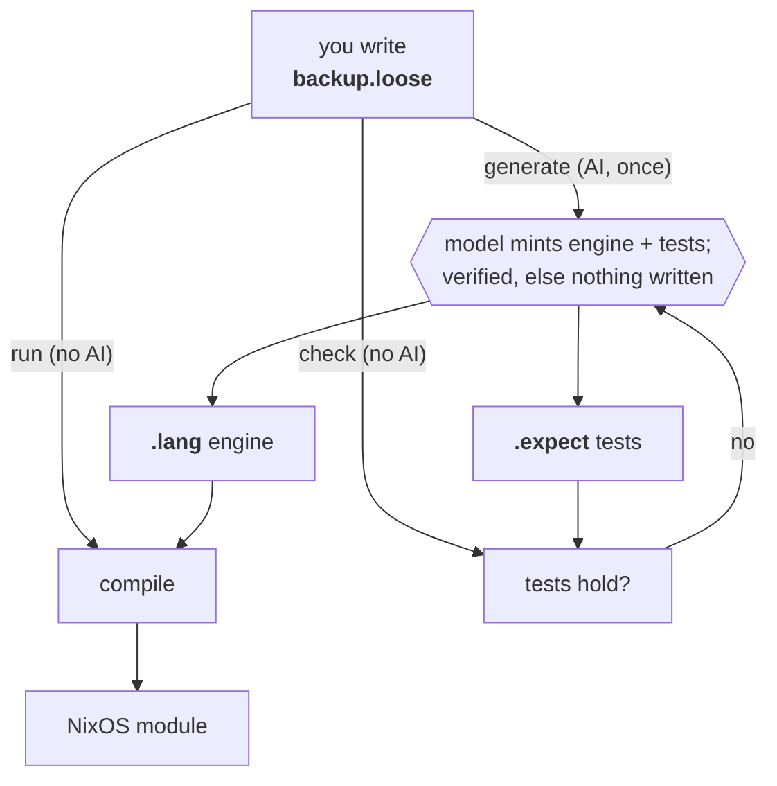

# lips

Write intent, not code. You state what a system should do in a few plain
lines; a machine turns that into a running NixOS configuration,
deterministically, with no AI in the loop after the first step.

Why: AI writes code faster than anyone can review it. lips keeps the
human-owned artifact small enough to read, and everything below it
deterministic.

## Try It

With direnv, `direnv allow` once; otherwise prefix commands with
`nix develop -c`.

    just run examples/backup.loose  # loose text -> NixOS module (offline)
    just generate path/to/my.loose  # mint a language for your own program (AI, needs pi)
    just test                       # conformance suite

The whole source of the example is `examples/backup.loose`:

    back up /var/lib/ledger to /backup/ledger daily.
    keep 14 daily snapshots.
    credentials come from /etc/ledger-backup.env.

Edit a path or the count and `just run` again: the change flows through with
no AI.

## How It Works

**Generate, once (the only AI step).** A model mints an *engine* for your
problem: patterns that read your lines, rules that map them to NixOS options,
and tests that pin your values. lips verifies the engine builds your program
and the tests hold, else it writes nothing.

**Run, forever (no AI).** The engine compiles your text to a NixOS module,
offline, bit-identical. A line the engine cannot read fails loud and points
back to `generate`; lips never guesses.

**Regenerate, gated.** A fresh engine is accepted only if the committed tests
still hold. To change behavior on purpose, delete `.expect` and regenerate:
that diff is the semantic changelog.

| File | Author | Role | In git |
|------|--------|------|--------|
| `backup.loose` | you | the program | yes, the only source |
| `backup.loose.lang` | AI, once | the engine | yes |
| `backup.loose.expect` | AI, once | the tests | yes |
| `backup.loose.generation` | machine | receipt of the AI call | yes |
| `backup.loose.decisions` | machine | cache of the machine's reading | no |

Everything the machine writes is traceable: each `.lang` line ends in
`@gen:<fingerprint>`, the hash of the exact AI call recorded in
`.generation`. And `.decisions` shows the machine's reading of your program,
one precise statement per line you wrote; read it to verify "did it
understand me?".

If the machine burned down, the `.loose` file is the only thing you could not
regenerate. That is the whole design.

## Layout

- `kernel/` — the deliverable: decision calculus + conformance suite
  (module map: `kernel/README.md`).
- `examples/` — demonstration programs with their minted artifacts.
- `docs/superpowers/specs/` — design doc
  (`2026-07-18-lipsidea-design.md`; milestone ledger in section 13).
- `justfile` — all commands; `just` lists them.
