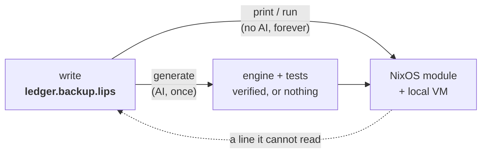

  

# lips

Describe what a system should do in plain lines. lips grows a small language
around exactly those words and gives you its compiler for free; from then on it
turns your intent into a running system deterministically, with no AI in the
loop.

The point is to keep what a human owns small enough to read. AI now writes code
faster than anyone can review it, so lips shrinks the reviewed artifact to a few
lines of meaning and makes everything the machine derives from them reproducible
and offline.

## The Idea

Writing your intent and building a language for it are the same act.

You start by writing plainly what you want:

    back up /var/lib/ledger to /backup/ledger daily.
    keep 14 daily snapshots.
    credentials come from /etc/ledger-backup.env.

That file is already a valid program. When you run `generate` once, a model
reads your lines and mints a small **engine**: the grammar that reads sentences
like yours, the rules that map them to real NixOS options, and tests that pin
your values. In other words, the wording you chose defines a little language
for your problem, and lips hands you the compiler for it.

From then on the AI is gone. `print` compiles your text to a NixOS module
offline and bit-identical, every time. Edit a path or a number and print again;
the change flows straight through. The language you grew stays yours to write
in, and the compiler keeps working without a model ever running again.

A line the engine cannot read fails loudly and sends you back to `generate`.
lips never guesses.

## How You Work With It

The loop has three moves. Only the first touches a model.

**Write.** State intent in plain lines. This is the only artifact you own and
the only one you cannot regenerate. Keep it short and truthful.

A program is named `<instance>.<language>.lips` and read right to left. The
`.lips` extension is the constant marker every editor and language server keys
on (one extension, so vim, VS Code, Emacs, and Helix all recognize a program
with no per-language setup). The segment before it, `<language>`, names the
lips language the program is written in -- a reusable grammar shared by every
program in it. What precedes that, `<instance>`, names this one instance.

So `ledger.backup.lips` is the instance `ledger`, written in the language
`backup`. A sibling `photos.backup.lips` reuses the same `backup.lang` grammar
with no new AI; each realizes to its own instance
(`services.restic.backups.ledger.*` and `...photos.*`) and the two compose in
one configuration without collision. The instance is optional: `backup.lips`
alone is the singleton shorthand, its instance name defaulting to the language.
Start there and add named instances later, no re-mint.

**Generate (once, AI).** `lips generate ledger.backup.lips` mints the engine
and the tests for the language; pass several programs
(`lips generate a.backup.lips b.backup.lips`) and it generalizes one grammar
across them. lips refuses to write anything unless the engine actually compiles
every program and the tests hold, so a bad mint costs you nothing.

**Print and run (forever, no AI).** `lips print ledger.backup.lips` compiles
your text to a NixOS module. `lips run ledger.backup.lips` goes further and
boots that module in a throwaway local VM, so you can watch it work without
touching your host.

You then edit freely. Value and wording changes covered by your language run
straight through `print`. You return to `generate` only when you say something
genuinely new that the language cannot yet read, and even then regeneration is
gated: a fresh engine is accepted only if the committed tests still hold. To
change behavior on purpose you delete the `.expect` file and regenerate, and
that diff is your semantic changelog.

**Steer the mint (optional).** To express taste about *how* the engine gets
built, put a plain-text `backup.direction` file beside the language (named by the
language, so it is shared): "prefer restic over rsync", "no docker", "secrets
via env files". It shapes generate
only, and stays advisory: preferences about mechanism, never requirements.
Anything that *must* hold belongs in the program or its tests, not here. The
file is optional; absent, nothing changes.

## Try It

With direnv, run `direnv allow` once. Otherwise prefix each command with
`nix develop -c`.

    just print examples/ledger.backup.lips   # loose text -> NixOS module (offline)
    just run   examples/ledger.backup.lips   # ... and boot it as a local VM (needs KVM)
    just generate path/to/my.backup.lips     # mint a language for your program (AI, needs pi)
    just test                                # conformance suite

Open `examples/ledger.backup.lips`, change `/backup/ledger` or `14`, and run
`just print` again. The module updates with no AI. Then add a sentence the
language does not know and watch it fail loud, pointing you back to `generate`.
To see reuse, look at `examples/photos.backup.lips`: a second instance of the
same `backup` language, sharing `backup.lang`.

Sometimes intent needs a program written, not just a package configured.
`examples/hello.http.lips` asks for a small HTTP server; its engine builds
that server from generated Go source (a Nix `buildGoModule` derivation) and
runs it as a service. The source is a committed, reviewable file beside the
program; the build and run stay deterministic and offline. The `artifact-vm`
flake check compiles it and boots the service in a VM.

## The Files

For a program `ledger.backup.lips`, everything else sits beside it. The four
language artifacts are named by the language (`backup.*`) and shared by every
`*.backup.lips` program; the program and its crystal witness are per instance.
You own the first line; the machine writes the rest.

| File | Author | Role | In git |
|------|--------|------|--------|
| `ledger.backup.lips` | you | the program (instance `ledger`), the only real source | yes |
| `backup.lang` | AI, once | the engine (grammar + rules + tests), shared by the language | yes |
| `backup.expect` | AI, once | behavioral tests that gate regeneration, shared | yes |
| `backup.direction` | you | optional taste steering the mint, shared | yes, if you want it |
| `backup.generation` | machine | receipt of the exact AI call, shared | yes |
| `ledger.backup.lips.decisions` | machine | the machine's reading of this program | no (cache) |

Everything the machine writes is traceable. Each `.lang` line ends in
`@gen:<fingerprint>`, the hash of the AI call recorded in `.generation`. And
`.decisions` shows how the machine read you, one precise statement per line, so
you can check "did it understand me?" before trusting the output.

If everything burned down, the program file is the only thing you could not
recreate. That is the whole point.

## Layout

- `kernel/` is the deliverable: the decision calculus and its conformance
  suite. Module map in `kernel/README.md`.
- `examples/` holds demonstration programs with their minted engines.
- `docs/superpowers/specs/` holds the design doc,
  `2026-07-18-lipsidea-design.md`, whose section 13 tracks milestones.
- `justfile` lists every command. Run `just` to see them.
