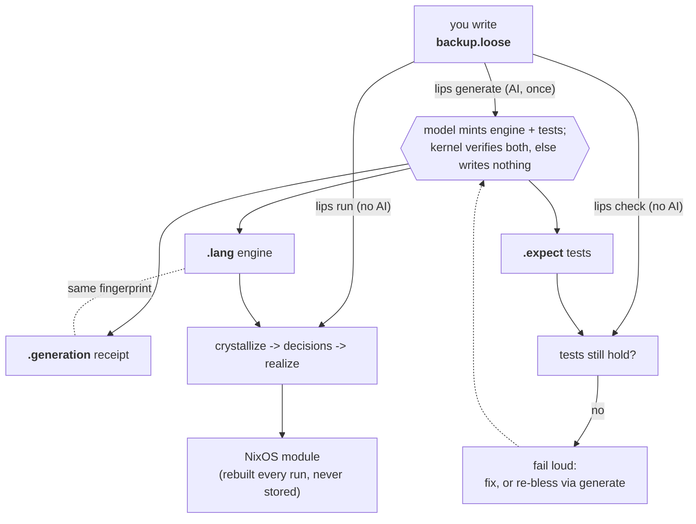

# lips

Write intent, not code. You state what a system should do in a few plain
lines; a machine turns that into a running NixOS configuration and keeps doing
so deterministically, with no AI in the loop after the first step.

The point: AI writes code faster than anyone can review it. lips moves the
human-owned artifact up to intent and keeps execution deterministic below it,
so the thing you read and version is a handful of lines of domain truth
instead of thousands of lines of mechanism.

## Try It

Tools come from the flake. With direnv, `direnv allow` once and `ghc` + `just`
are on your path; otherwise prefix commands with `nix develop -c`.

    just                            # list commands
    just run examples/backup.loose  # loose text -> NixOS module (offline)
    just test                       # conformance suite

The example program, `examples/backup.loose`, is the whole source:

    back up /var/lib/ledger to /backup/ledger daily.
    keep 14 daily snapshots.
    credentials come from /etc/ledger-backup.env.

`just run` turns it into a `services.restic.backups.ledger` module. Change a
path or the count and run again: the edit flows through with no AI.

For your own program (the model call needs `pi` on your path):

    just generate path/to/my.loose
    just run path/to/my.loose

## The Loop

1. **Write** a loose-text program: a few lines saying what you want.
2. **Generate**, once. The only AI step: a model mints a small formal
   *language* and *engine* for your problem, plus the *tests* that pin your
   values. Nothing is written unless the engine builds your program end to end
   and the tests hold. The model never runs again after this.
3. **Run**, forever. The engine turns your text into a NixOS module,
   deterministically and offline. A line the language cannot read fails loud
   and points back to `generate`; lips never guesses.

`generate` is authoring; `run` is a compiler. Unplug the network and delete
the model, and `run` still works, bit-identical.

## The Files

You write one file; the machine produces the rest.

| File | Author | Role | In git |
|------|--------|------|--------|
| `backup.loose` | human | the program: intent in plain lines | yes, the only source |
| `backup.loose.lang` | AI, once | the engine: patterns that read your lines, rules that map them to NixOS options | yes |
| `backup.loose.expect` | AI, once | the tests: which option must carry which program value | yes |
| `backup.loose.generation` | machine | the receipt of the one AI call | yes |
| `backup.loose.decisions` | machine | cache: the machine's reading of your program | no, derived |

If the machine burned down, the loose file is the only thing you could not
regenerate. That is the whole design.

## The Dev Loop

- **Edit a value** in `.loose`: `lips run` absorbs it offline. The tests still
  hold because they bind options to your *current* value, not a frozen copy.
- **Write something new** the language cannot read: `run` fails loud; run
  `generate` to grow the language.
- **Regenerate**: the model mints a fresh engine, but `generate` accepts it
  only if the committed `.expect` still holds against the result. To change
  behavior on purpose, delete `.expect` and regenerate; that deletion is your
  explicit re-bless, and its diff is the semantic changelog.

`just check` runs the deeper proof: the conformance suite plus booting the
realized module in a NixOS VM. `just check-expect` verifies every example's
contract.

## Under the Hood

**Decisions.** The machine restates each of your lines as one precise,
traceable statement:

    d1 oblige backup.job stated "/var/lib/ledger /backup/ledger daily" @backup.loose:1

Read `.decisions` to verify "did it understand me?". Everything downstream
works from decisions, never from your raw sentences, and the engine itself is
decisions too: one building block all the way down.

**The fingerprint.** `generate` hashes the exact inputs of the AI call into an
id like `d5eb594c07fc434f`. Every minted line carries it (`@gen:...`), and
`.generation` is the matching receipt. Any engine line traces to the one event
that produced it; nothing is anonymous.

## Layout

- `kernel/` — the deliverable: the decision calculus (Haskell reference
  implementation) plus its conformance suite; module map in `kernel/README.md`.
- `examples/` — demonstration programs with their minted artifacts.
- `docs/superpowers/specs/` — the design doc (start with
  `2026-07-18-lipsidea-design.md`, milestone ledger in section 13), plans,
  surveys.
- `flake.nix` / `justfile` — build, dev shell, checks; `just` lists commands.
